<h1>Felix Makinda</h1>

**Senior Software & AI/ML Engineer** · Nairobi, Kenya · East Africa Time (UTC+3)

I build backend systems and production AI: multi-agent workflows, retrieval pipelines, and the APIs, data and cloud infrastructure they run on. I take systems from prototype to production and hand them over to teams that can run them.

   

---

### What I work on

- **Backend engineering.** APIs, services and data models in Python (FastAPI), Java (Spring Boot), Node and Go, on PostgreSQL and event-driven infrastructure that stays fast and observable.
- **AI/ML engineering.** Multi-agent systems, RAG pipelines, QLoRA fine-tuning and evaluation, with guardrails that keep model output grounded, testable and auditable.
- **Cloud & DevOps.** Kubernetes, Terraform and CI/CD on AWS, Google Cloud and Azure.
- **AI & automation consulting.** Finding the work worth automating, sizing the payoff, and choosing the simplest approach that will hold up in production.

### Selected work

| Project | What it does | Built with |
| --- | --- | --- |
| **[Orbit](https://orbit.co.ke)** | Multi-agent platform guiding Kenyan KCSE students through university matching and career counselling. Served 2,000+ students in March 2026. | Google ADK, Cloud Run, RAG, Supabase, M-PESA |
| **[Okione](https://okione-devsecops.vercel.app)** · [code](https://github.com/felixmakinda/okione-devsecops) | Seven-agent DevSecOps copilot that turns application source into CIS-hardened Kubernetes manifests, with five layers of hallucination prevention. | IBM watsonx.ai (Granite), FastAPI, Kubernetes, Trivy |
| **Incident Response Agent** · [code](https://github.com/felixmakinda/incidence_response) | Detects customer incidents from email and runs the whole first response in under 60 seconds: reply, war room, Jira ticket, Slack alert and runbook. | Gmail API, Pub/Sub, Jira, Slack, SSE |
| **Alex, AI financial planner** | Five orchestrated agents analyse an investment portfolio and project retirement income, deployed serverless on AWS. | OpenAI Agents SDK, Bedrock, Lambda, Aurora, Terraform |
| **[Egiaito](https://gusii.org)** | Community platform and NLP dataset for Ekegusii, an under-resourced African language with 5M+ speakers: 10,000+ words and a speech-recording pipeline. | Next.js, PostgreSQL, Prisma, Cloudflare R2, Playwright |

### Activity

<picture>
  <source media="(prefers-color-scheme: dark)" srcset="assets/activity-dark.svg">
  
</picture>

<picture>
  <source media="(prefers-color-scheme: dark)" srcset="assets/languages-dark.svg">
  
</picture>

### Stack

**Languages & backend** 

**Data, cloud & infrastructure** 

**AI / ML** 
 
LangGraph · LangChain · Google ADK · OpenAI Agents SDK · CrewAI · Amazon Bedrock · SageMaker · Vertex AI · IBM watsonx.ai · RAG · QLoRA fine-tuning · MCP · LangSmith

### Background

- **Now:** independent AI & automation consultant, and AI & Software Engineering Fellow in the Andela talent network (AI Engineering, graduated with distinction, 2026)
- **2024 to 2025:** Tech Lead & Full-Stack Engineer at Univar Logistics, owning architecture, cloud infrastructure and CI/CD
- **2022 to 2024:** AI Program Coordinator (contract) at Scale AI, running quality for frontier-model training data
- **2017 to 2022:** freelance software engineer building POS, ERP and property systems with M-PESA integrations
- B.Sc. Computer Science (JKUAT) · DevOps Engineering, Moringa School (distinction) · Kubernetes & Cloud Native (Linux Foundation)

---

Graphs are generated daily by a GitHub Action in this repository from the GitHub API, so they never depend on a third-party service.
